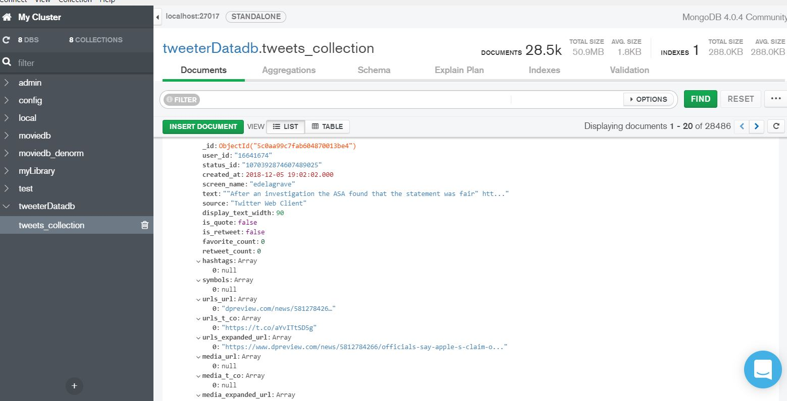

```{r setup, include=FALSE}
knitr::opts_chunk$set(echo = TRUE)
```

### Data Extraction (Tweets Collection - R-Code)

Here, we are going to collect the tweets created for some of newly related products like 'iphone XS' and 'Nexus Pixel' using tweeter apis(rtweet). rtweet is a wrapper package around the original package 'tweeteR'

'search_tweets' method is being used to pull the tweets. below are description of arguments used. 


+ **n**= 18000 is max number of tweets that needs to be pulled.
+ **include_rts** : whether to include retweet feed or not. For avoiding possible Ads, we chose False for this option. 
+  **retryonratelimit** : twitter has rate limitation on pull request. So this option will help to wait for next pull the next batch of tweets when the rate is already reached. 
+ **lang** ='en' mentions the langauge. For sake of simplicity, we chose English as the language. 
+ **q** is the first parameter which is search keyword. We used the hastag #IphoneXS and word 'iphone XS' for iphone tweet collections and hashtag #pixel3 and 'Pixel 3' for Pixel3 tweet collections. 

For sake of scrubbing the consumer and secret keys, I put the entire collecton code into a 'False' block. This is just for demonstration in mark down and we executed in our local and made the data available in csv format in github. 
  `
```{r}
library("rtweet")

if(FALSE) {
  
create_token(
  app = "my_twitter_research_app",
consumer_key <- 'XXXX',
consumer_secret <- 'XXXX',
access_token <- 'XXXX',
access_secret <- 'XXXX')

iphone_xs <- search_tweets(
  "#iPhoneXS OR 'iphone XS'", n = 18000, include_rts = FALSE, retryonratelimit = TRUE, lang = 'en'
)

nexus_pxel <- search_tweets(
  "#pixel3 OR pixel3 OR 'Pixel 3'", n = 18000, include_rts = FALSE, retryonratelimit = TRUE, lang = 'en'
)


# write this into a csv file and later uploaded into github for pair programming. 
write_as_csv(x = iphone_xs , file_name = 'iphone_xs.csv')
write_as_csv(x = nexus_pxel , file_name = 'tweets_nexus_pxel.csv')


}

```

### Staging the tweet data into mongoDb

One of the best practice in any huge data collection is to persist the row data into a staging table. In Big data world, this is often pushed into a 'Data Lake' peristance like Hadoop, NoSql. Then later data analyst and scientists pulls required data they need for analysis and model creation. When the data is collected like this in a real time fashion, the process is called **data pipelining** where data is collected, extracted and cleaned and flow from one phase to another. Below is the data flow diagram of collecting, extracting, cleaning and analysising. 


Here, we are staging the raw data into a mongodb. We tried to perist into a mysql db, but some of the tweet field is list. so It was not a good idea to save the data into mysql. One way is to save it into a Doumented oriented noSql database like MongoDb. A new column **topic** is added to indicate the topic and the date of collection. Both iphone and Pixel3 data are persisted into 'tweets_collection' table into 'tweeterDatadb' database. 

Foe eg: 'Iphone_2018_12_5', the topic is 'Iphone' and date of collection is '2018_12_5'

```{r}
if(FALSE) {
iphone_xs$topic <- "Iphone_2018_12_5"
nexus_pxel$topic <- "Nexus_Pixel_2018_12_5"


mongodb <- mongo(collection = "tweets_collection", db = "tweeterDatadb")
mongodb$insert(iphone_xs1)
mongodb$insert(nexus_pxel)
}
```

Below is the mongoDB compas view of data. 




## Extracting required data from Mongo DB 

Below is the code to extract some of relevent data for analysis. we are using mongodb $find method to fetch 
using **query** and **fields** arguments. 

```{r}
if(FALSE) {

df_iphoneXS<- mongodb$find(query  = '{"topic" : "Iphone_2018_12_5"}',
                   fields  = ' {"user_id": true, 
                                "created_at" : true, 
                                "screen_name" : true,
                                "text" : true,
                                "source" : true ,
                                "followers_count" : true, 
                                "location" : true }' )


df_pixel<- mongodb$find(query  = '{"topic" : "Nexus_Pixel_2018_12_5"}',
                   fields  = ' {"user_id": true, 
                                "created_at" : true, 
                                "screen_name" : true,
                                "text" : true,
                                "source" : true ,
                                "followers_count" : true, 
                                "location" : true }' )

write_as_csv(x = df_iphoneXS , file_name = 'ExtractedData_iphone_xs.csv')
write_as_csv(x = df_pixel , file_name = 'ExtractedData_tweets_nexus_pxel.csv')

}
```

Both staged and extracted data is uploaded to github account for pair coding. 
Below code is used for pulling both staged data and extracted data from github. 

```{r}
library(readr)
iphone_xs <- read.csv("https://raw.githubusercontent.com/charlsjoseph/CUNY-Data607/master/Data607-Final_Project/iphone_xs.csv")

nexus_pxel <- read.csv("https://raw.githubusercontent.com/charlsjoseph/CUNY-Data607/master/Data607-Final_Project/tweets_nexus_pxel.csv")

df_iphoneXS_extrd <- read.csv("https://raw.githubusercontent.com/charlsjoseph/CUNY-Data607/master/Data607-Final_Project/data/ExtractedData_iphone_xs.csv")


df_pixel_extrd <- read.csv("https://raw.githubusercontent.com/charlsjoseph/CUNY-Data607/master/Data607-Final_Project/data/ExtractedData_tweets_nexus_pxel.csv")


```

Below is the timeline graph for both iphone and pixel3 tweets, This shows tweets are from the past 8-9 days from the date of collection( 05-Dec-2018 )

Number of Iphone tweets collected : **16401**

Number of Pixels tweets tweets collected : **12085**

```{r}

ts_plot(iphone_xs, "1 hours") +
  ggplot2::theme_minimal() +
  ggplot2::theme(plot.title = ggplot2::element_text(face = "bold")) +
  ggplot2::labs(
    x = NULL, y = NULL,
    title = "Frequency of #iphoneXS Twitter statuses",
    subtitle = "Twitter status (tweet) counts aggregated using one-hour intervals",
    caption = "\nSource: Data collected from Twitter's REST API via rtweet"
  )


ts_plot(nexus_pxel, "1 hours") +
  ggplot2::theme_minimal() +
  ggplot2::theme(plot.title = ggplot2::element_text(face = "bold")) +
  ggplot2::labs(
    x = NULL, y = NULL,
    title = "Frequency of #pixel3 Twitter statuses",
    subtitle = "Twitter status (tweet) counts aggregated using one-hour intervals",
    caption = "\nSource: Data collected from Twitter's REST API via rtweet"
  )

nrow(iphone_xs)

nrow(nexus_pxel)


```

