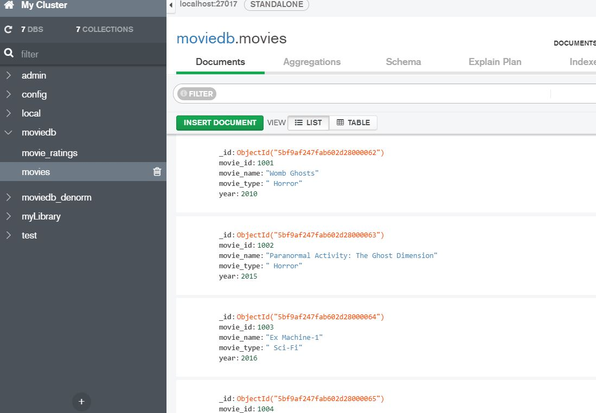
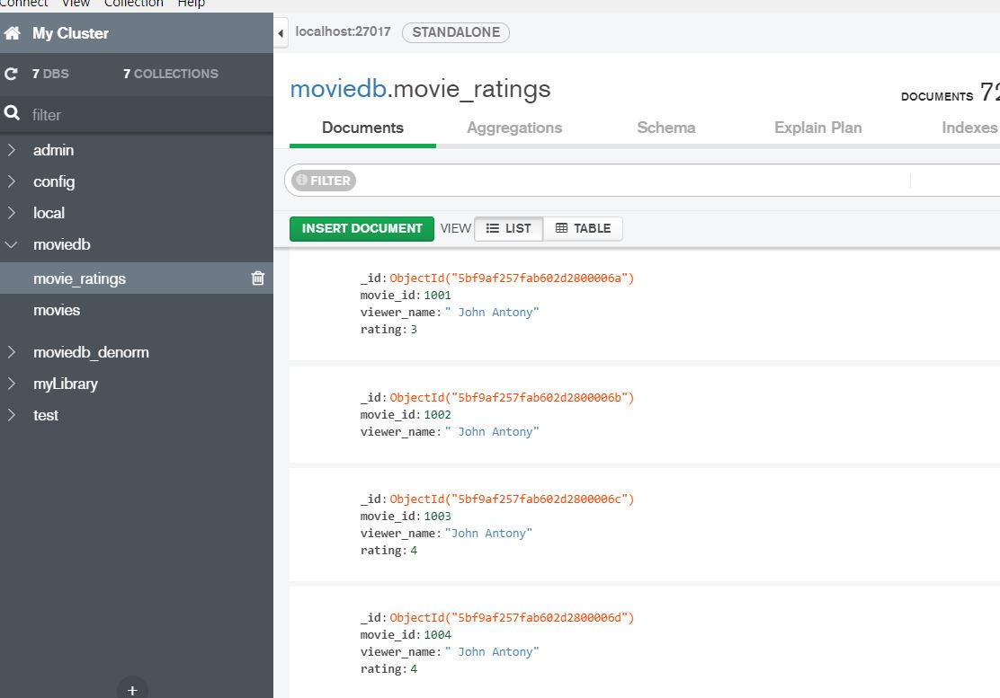
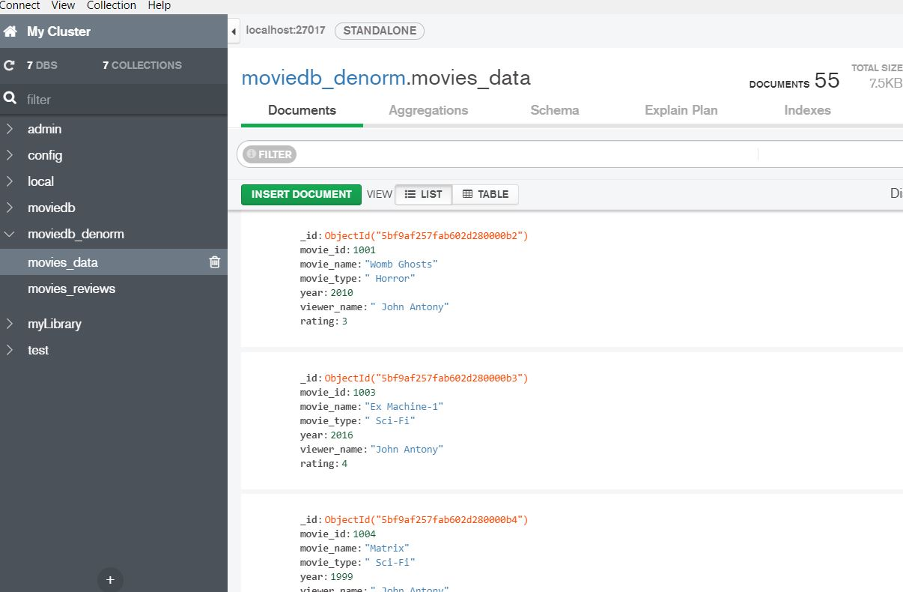
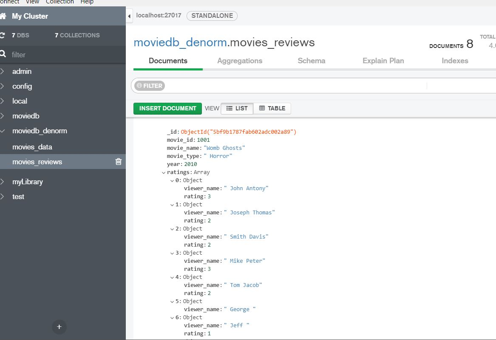

```{r setup, include=FALSE}
knitr::opts_chunk$set(echo = TRUE)
#install.packages("mongolite")
require("RMySQL")
require("dplyr")
require("htmlTable")
require("mongolite")
require(jsonlite)   #converting data into JSON

```

## Migration from relational db to mongo. 

Load the data from mysql into dataframe.

```{r}

mydb = dbConnect(MySQL(), user='root', password='mysql@123', dbname='movies', host='localhost')
movie_ratings <- dbGetQuery(mydb, "select * from movie_ratings")
movies <- dbGetQuery(mydb, "select * from movies")
head(movie_ratings)
head(movies)


```

### Load data in normalised way.
Here, we are loading the data as it is in mySQL. Both 'movies' and 'movie_ratings' goes into the collection 'movies' and 'movie_ratings'  respectively in mongo db. 

Connect to mongo db and persist the data frame into mongo db collection. 


```{r}
mongodb <- mongo(collection = "movies", db = "moviedb")
mongodb$insert(movies)
mongodb <- mongo(collection = "movie_ratings", db = "moviedb")
mongodb$insert(movie_ratings)

```

Below is the snapshot from mongodb Compas. 






### Load data in denormalised way. 

Now, lets dnormalise the data and keep the review data into one collection. 
In NoSql, this is quite okay to denormalize the data in one collection. This means that data is not segregated in multiple tables. Instead the data are grouped together and noSql gives a flexibilty to evolve the schema without impacting existing records.  

```{r}
movies_denorm <- dbGetQuery(mydb, "select movies.movie_id, movies.movie_name , movies.movie_type , movies.year, movie_ratings.viewer_name, movie_ratings.rating from movies
join movie_ratings on movies.movie_id = movie_ratings.movie_id  and movie_ratings.rating is not null")
head(movies_denorm)
mongodb1 <- mongo(collection = "movies_data", db = "moviedb_denorm")
mongodb1$insert(movies_denorm)


mongodb1$find()

mongodb1$find(query  = '{"movie_id":1001}')

mongodb1$find(query  = '{"viewer_name":"Tom Jacob"}')

```

Below is the snapshot from mongodb Compas. 




### Load data with nested data.

Here, the review data is nested in movie data. 
Benefits: Movie data is not redudant and review data is in nested format. 
This is upto your requirment. Lets say I need the list of review and movie data on a particular movie name, I just give movie name as input paramter and it returns the movie and it review data.

Below is the code snippet that demonstrate this design.


```{r}

mongodb2 <- mongo(collection = "movies_reviews", db = "moviedb_denorm")


for (i in 1:nrow(movies)){
    reviews <- movie_ratings %>% filter(movie_id == movies$movie_id[i]) %>%  select(viewer_name ,rating)
    movieDf <- movies[i,]
    movieDf$ratings <-  c(list(reviews))
    movie_rating_json <- toJSON(movieDf)
    print(movie_rating_json)
    mongodb2$insert(fromJSON(movie_rating_json))
}


```

Below shows the pretty print version of Json data from Mongo db. 

```{r}
movie_Womb_Ghosts <- mongodb2$find(query  = '{"movie_name":"Womb Ghosts"}')
print(prettify(toJSON(movie_Womb_Ghosts)))
```

Below is the snapshot from mongodb Compas. 





